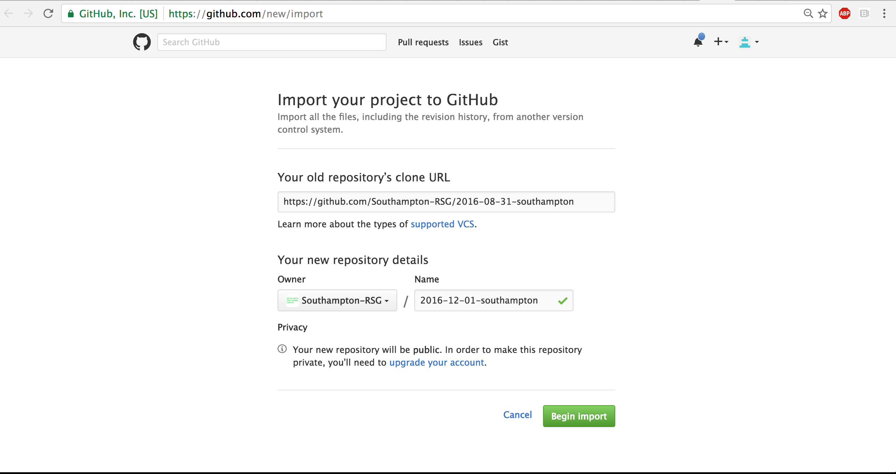

# SOUTHAMPTON RESEARCH SOFTWARE GROUP'S SOFTWARE CARPENTRY WORKSHOP TEMPLATE

This repository is inspired by the standard Software Carpentry workshop template but specific to University of Southampton Research Software Group's template for creating websites for workshops.

Updated Python lessons are present in [Southampton's August SWC workshop repository](https://github.com/Southampton-RSG/2016-08-31-southampton).

All the work including workshop lessons has to be done in your repository's `gh-pages` branch since that is what is [automatically published as a website by GitHub](https://help.github.com/articles/creating-project-pages-manually/).

Please follow the instructions below to create a website respository for SWC workshop in the section below.

## Creating a Repository

1. Go to [GitHub's importer](https://github.com/new/import).

2. Click on "Check the URL".  (GitHub won't import until you've done this.) 

3. Select the owner for your new repository. (This will probably be you or may be an organization you belong to.)

4. Choose a name for your workshop website repository. This name should have the form `YYYY-MM-DD-site`, e.g., `2016-12-01-southampton`.

5. Make sure the repository is public.

6. You should have a page like this: 

Now click "Begin Import". After the process is over, click "Continue to repository" to view the newly-created workshop repository with Soton template and updated Python, Git and Python unit testing material. 

**Note:**
some people have had intermittent errors during the import process,
possibly because of the network timing out.
If you experience a problem, please re-try;
if the problem persists,
please [get in touch with Southampton RSG group](http://rsg.soton.ac.uk/contact) or create an issue in this repository here. 

To clone your new repository, use:

~~~
git clone -b gh-pages https://github.com/your_username/YYYY-MM-DD-site
~~~

This is needed because the imported repository doesn't have a `master` branch.

**Note:** Please do all of your work in your repository's `gh-pages` branch,
since [GitHub automatically publishes that as a website](https://help.github.com/articles/creating-project-pages-manually/).

## Installing Software for updating this workshop repository

In order to preview the workshop website along with lessons locally on your computer, you must install the software described below.

The Makefile that uses *pandoc* to generate html format pages for workshop main webpage and lessons webpages is present in the repository [here](https://github.com/Southampton-RSG/2016-08-31-southampton/Makefile). Each directory or set of markdown files has its own `Makefile` for conversion of document formats.

1. **Installing `Make`**: The above process of making `html` pages from `markdown` format files is managed using a tool called `make`.Above mentioned `Makefile` contains some rules governing how to produce a target file that might have a number of prerequisites. In our case, a HTML file is the target, and the various figures and data tables are the prerequisites—if the code that produces the prerequisites changes, the final document will change too. Install by following the instructions from [here](https://www.gnu.org/software/make/) based on your Operating System.

2. **Installing `pandoc`**: Pandoc is needed, if you want to convert files from one markup format into another. Install by following instructions from [here](http://pandoc.org/installing.html) based on your Operating System.

## Customizing Your Workshop Website

1. Go into your newly-created repository, which will be at `https://github.com/your_username/YYYY-MM-DD-site`. For example, if `your_username` is `Southampton-RSG`, the repository's URL will be `https://github.com/Southampton-RSG/2016-12-01-southampton`.

2. Clone the repository using the command:

   `git clone https://github.com/Southampton-RSG/2016-12-01-southampton`

3. Edit `index.html` to customize the list of instructors, workshop venue, etc.You can do this in the browser by clicking on it in the file view and then selecting the pencil icon in the menu bar or you can clone the repository to your desktop, edit `index.html` there, and push your changes back to the repository.

4. The URL for your workshop website is determined automatically based on the URL for your repository. If your respository is at `https://github.com/Southampton-RSG/2016-12-01-southampton`, its GitHub Pages website is at `http://Southampton-RSG.github.io/2016-12-01-southampton`.

5. When you are done editing, please run below commands in sequence:

   **Note:** Make sure `Makefile` is present in the directory where you'll be running these commands.

   * Check your changes by running:

     ~~~
     make check
     ~~~
     This runs `tools\check.py`. 

   * Preview your changes by running:

     ~~~
     make preview
     ~~~
     This runs `tools\preview`. After this, you should be able to preview your pages locally by opening newly-created `html` pages from respective `md` files. 

6. Now, you can add and push the changes to remote repository and you can then preview your website. If your repository is `https://github.com/your_username/YYYY-MM-DD-site`, its website will be `http://your_username.github.io/YYYY-MM-DD-site`.

